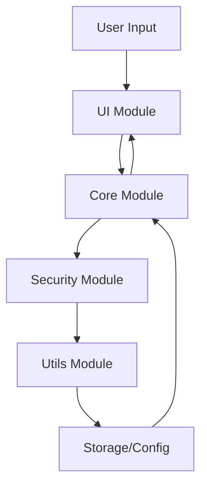

# SSH Key Manager Architecture

## Overview

SSH Key Manager is built with a modular architecture focusing on security, extensibility, and ease of use. The system is divided into several core components, each handling specific aspects of SSH key management.

## Core Components

### 1. Core Module (`keyctl/core/`)

#### Key Management (`key_manager.py`)
- Key creation and deletion
- Key rotation
- Permission management
- Key validation
- Git configuration management

#### Configuration (`config_manager.py`)
- Configuration loading/saving
- Settings management
- User preferences

#### Provider Integration (`providers.py`)
- Git provider support
- Provider-specific validations
- Custom host management

### 2. Security Module (`keyctl/security/`)

#### Key Security (`key_security.py`)
- Permission validation
- Key strength analysis
- Security recommendations
- Encryption handling

#### Backup Management (`backup_manager.py`)
- Secure backup creation
- Backup encryption
- Restore functionality
- Verification systems

### 3. UI Module (`keyctl/ui/`)

#### Interface (`interface.py`)
- Interactive CLI
- Menu management
- User input handling
- Output formatting

#### Display (`display.py`)
- Progress indicators
- Color output
- Status messages
- Error displays

### 4. Utils Module (`keyctl/utils/`)

#### Logging (`logger.py`)
- Operation logging
- Error tracking
- Audit trail
- Debug information

#### Statistics (`stats.py`)
- Usage tracking
- Analytics
- Performance metrics

## Data Flow



## Security Model

### Key Storage
- Keys stored in `~/.ssh/`
- Strict permission enforcement (0600)
- Optional encrypted storage
- Secure backup system

### Authentication
- User ownership validation
- Permission checks
- Optional MFA support
- Session management

### Encryption
- Key encryption at rest
- Secure backup encryption
- Transport security
- Memory security

## Extension Points

The system is designed to be extensible in several areas:

1. **Provider Support**
   - New Git provider integration
   - Custom host support
   - Authentication methods

2. **Security Features**
   - Additional encryption methods
   - New key types
   - Custom security policies

3. **UI Enhancements**
   - GUI support
   - Web interface
   - API endpoints

## Configuration

The configuration files are stored in standard locations:
- Config: `~/.keyctl.json`
- Logs: `~/.keyctl.log`

### Configuration Format
```json
{
    "last_used": "key_name",
    "repo_keys": {
        "github.com": "key_name"
    },
    "key_expiration": {
        "key_name": "2024-12-31T23:59:59"
    }
}
```

## Performance Considerations

1. **Optimization**
   - Lazy loading of configurations
   - Caching of frequently used data
   - Efficient key operations

2. **Resource Usage**
   - Minimal memory footprint
   - Efficient file operations
   - Background task management

## Error Handling

1. **Error Categories**
   - Permission errors
   - Configuration errors
   - Network errors
   - Key operation errors

2. **Recovery Procedures**
   - Automatic retry mechanisms
   - Fallback procedures
   - Data recovery options

## Testing Strategy

1. **Unit Tests**
   - Core functionality
   - Security features
   - Configuration management

2. **Integration Tests**
   - Provider integration
   - System interaction
   - End-to-end workflows

## Deployment

1. **Installation**
   - PyPI package
   - System packages
   - Docker container

2. **Updates**
   - Automatic updates
   - Configuration migration
   - Backup preservation 